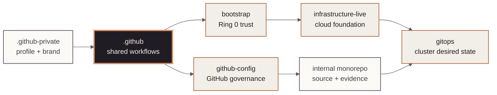

<!-- mindclade-doc: repository-home@2 -->
<!-- Brand source: mindclade/.github-private/mindclade-brand-assets (MONO family). -->

<p align="center">
  <picture>
    <source media="(prefers-color-scheme: dark)" srcset="docs/assets/brand/mono-wordmark-dark-1080w.png">
    <source media="(prefers-color-scheme: light)" srcset="docs/assets/brand/mono-wordmark-1080w.png">
    
  </picture>
</p>

<p align="center">
  
  
  
  
</p>

# Mindclade · GitHub Platform

> **Platform Foundation · Shared automation**
> Publish versioned reusable workflows, workflow contracts, community-health defaults, and
> repository documentation standards for the Mindclade organization.

| Repository contract | Value |
| --- | --- |
| Class | `enterprise-control` |
| Visibility | `internal` |
| Change model | `pull-request` |
| Authority | `shared-workflows`<br>`community-health`<br>`workflow-contracts` |
| Start here | [`docs/README.md`](docs/README.md) |

## Mission

`.github` provides shared, versioned GitHub Actions interfaces and contributor defaults. Its
primary readers are maintainers evolving workflow APIs and repository teams consuming immutable
releases. The repository is intentionally internal and is not a second source of organization
or cloud policy.

## Authority boundary

### This repository creates

- Reusable CI, security, artifact, federation, and repository-hygiene workflow APIs.
- Workflow contract snapshots, starter workflows, and community-health content.
- The canonical repository-home template, brand usage rules, and offline documentation checks.

### This repository deliberately does not create

- Repositories, teams, access, rulesets, or protected-environment settings; those belong to
  `github-config`.
- Google Cloud resources, Kubernetes desired state, application source, or production secrets.
- Consumer adoption merely by merging here; consumers must pin and qualify an immutable release.

## Quick start

Run the complete offline repository and workflow contract checks:

```sh
nix develop .#ci --command make validate
nix flake check --no-update-lock-file
```

Expected result: workflow lint, action pins, compatibility snapshots, repository contracts,
documentation homes, and unit tests pass. Cloud-dependent workflow qualification remains a
separate protected lane. Do not create or move a release tag from an agent session.

## Estate position

The highlighted node is this repository. The authority table and exclusions are the text
equivalent of its shared-workflow relationship to the wider estate.



## Repository map

| Path | Purpose |
| --- | --- |
| `.github/workflows/reusable-*.yml` | Versioned workflow APIs. |
| `.github/workflows/required-*.yml` | Organization ruleset workflow implementations. |
| `contracts/workflows/` | Caller-visible compatibility snapshots. |
| `workflow-templates/` | Organization starter workflows. |
| `actions/` | Shared composite actions, including repository-home validation. |
| `docs/` | Trust, release, architecture, setup, and authoring standards. |
| `tools/`, `testdata/`, `tests/` | Offline validators and hermetic fixtures. |

## Change path

Treat reusable workflow inputs, secrets, outputs, job IDs, and permissions as public APIs.
Update the matching contract snapshot and changelog for intentional interface changes, pass
offline and smoke qualification, then let an operator publish a new immutable full-semver
release. Consumers adopt it through separately reviewed pin updates.

## Documentation and support

- [Documentation home](docs/README.md)
- [Architecture](docs/architecture.md)
- [Workflow contracts](docs/WORKFLOW_CONTRACTS.md)
- [OIDC and WIF](docs/WIF.md)
- [Enterprise setup](docs/ENTERPRISE_SETUP.md)
- [Contributing](CONTRIBUTING.md)
- [Support](SUPPORT.md)

## Security

Preserve least-privilege permissions, immutable third-party action pins, isolated identities,
and credential-free checkouts. Report vulnerabilities through
[the private security process](SECURITY.md).
