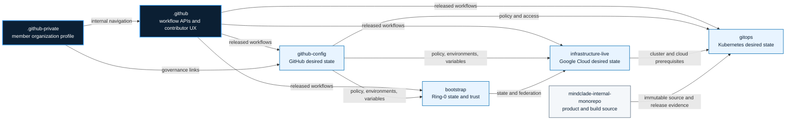

<!-- mindclade-doc: repository-home@1 -->

# Mindclade · GitHub Platform

> **Platform Foundation · Shared automation and organization policy**
> Versioned CI, workflow contracts, starter workflows, and contributor defaults for the
> Mindclade GitHub Enterprise organization.

| Repository contract | Value |
| --- | --- |
| Enterprise | [`mindclade`](https://github.com/enterprises/mindclade) |
| Organization | [`mindclade`](https://github.com/mindclade) |
| Repository index | [Mindclade repositories](https://github.com/orgs/mindclade/repositories) |
| Repository | [`mindclade/.github`](https://github.com/mindclade/.github) |
| Class | `enterprise-control` |
| Visibility | `internal` |
| Change model | Pull request to `main`; immutable full-semver releases |
| Documentation | [`docs/README.md`](docs/README.md) |

Organization-wide GitHub policy, community-health defaults, starter workflows, required
ruleset-workflow implementation, and reusable CI for Mindclade's GitHub Enterprise Cloud
organization.

> **Visibility contract:** this repository is intentionally **internal**. Do not make it
> public. `required-repository-policy.yml` verifies owner, default branch, visibility, lifecycle, and required Mindclade custom properties for every governed repository.

## Position in the repository estate



`.github` consumes policy and identity configuration; it does not provision GitHub or cloud
control planes. `github-config` owns GitHub desired state, `bootstrap` owns root durable cloud
trust, `infrastructure-live` owns normal GCP desired state and workload identities, and
`gitops` owns Kubernetes/Argo CD desired state.

## What belongs here

| Path | Responsibility |
|---|---|
| `.github/workflows/reusable-*.yml` | Versioned CI APIs for internal repositories |
| `.github/workflows/required-security-baseline.yml` | Language-neutral workflow attached by organization rulesets |
| `.github/workflows/{hygiene,smoke,required-repository-policy,pin-audit,release}.yml` | This repository's qualification/release automation |
| `workflow-templates/` | Organization starter workflows pinned to an immutable release |
| `contracts/workflows/` | Snapshots of reusable workflow API contracts |
| `.github/DISCUSSION_TEMPLATE/` | Shared design-proposal form where GitHub inheritance supports it |
| `.github/ISSUE_TEMPLATE/` and PR template | Maintenance UX for this repository; `github-config` distributes copies where inheritance does not apply |
| Root policy files | Community-health defaults |
| `docs/` | Enterprise setup, WIF trust contract, workflow-versioning contract |
| `testdata/` | Hermetic smoke-test fixtures |
| `tools/` | Offline validators and contract checks |

The canonical member-only organization profile lives in
[`mindclade/.github-private/profile/README.md`](https://github.com/mindclade/.github-private/blob/main/profile/README.md).
The local `profile/README.md` is only a pointer so the internal `.github` repository does not
become a second profile-content authority.

## Reusable workflow catalog

Consumers use immutable **full semver** releases. Do not call `@main`, a branch, or a moving
major tag.

```yaml
jobs:
  ci:
    uses: mindclade/.github/.github/workflows/reusable-go-ci.yml@v3.0.0
    with:
      go-version: "1.25.12"
```

The doubled `.github/.github/` is correct: the first `.github` is the repository name and the
second is the directory inside it.

| Workflow | Contract |
|---|---|
| `reusable-go-ci.yml` | Go build/vet/lint/race/coverage |
| `reusable-uv-ci.yml` | Locked uv sync, Ruff, Pyright, pytest |
| `reusable-rust-ci.yml` | rustfmt, locked metadata, Clippy, tests, cargo-deny |
| `reusable-codeql.yml` | Matrix CodeQL analysis |
| `reusable-tf-plan.yml` | WIF auth, fmt/init/validate, TFLint, Checkov, non-retained plan review |
| `reusable-oci-build.yml` | Docker/Bazel OCI build, SBOM, GitHub SLSA provenance + SBOM attestations, and linked-artifact record; cannot issue a deployment attestation |
| `reusable-binauthz-sign.yml` | Release-gated deployment attestation after distinct Buildkite build/provenance and qualification evidence |
| `reusable-wif-auth.yml` | OIDC-claim/WIF preflight; credentials intentionally do not escape its job |
| `reusable-repo-hygiene.yml` | Binary and repository-size budgets |
| `reusable-subtree-mirror.yml` | Controlled one-way subtree publication via GitHub App |

`required-security-baseline.yml` is different: `github-config` attaches it to organization/enterprise
rulesets so it runs without each consumer repository opting in. It performs dependency review
on pull requests and rejects newly changed workflow/action files that introduce mutable
third-party action references.

## Supply-chain model

- Third-party actions are pinned to full commit SHAs.
- Mindclade reusable workflow calls use immutable full-semver releases.
- GitHub Enterprise's organization policy should also require SHA pinning as defense in depth.
- OCI artifacts are addressed by digest.
- `actions/attest` supplies provenance and SBOM attestations for general GitHub-built OCI
  artifacts. It is not Mindclade's production build authority.
- OCI attestations are pushed to the registry and recorded as GitHub linked artifacts.
- Buildkite is the authoritative production builder and qualifier. It writes separate Binary
  Authorization build/provenance and qualification evidence roots for the same digest.
- GKE admission remains a third, separate Binary Authorization decision. Neither Buildkite
  evidence identity can issue it: the release-gated signer requires both evidence roots, a
  dedicated signer service account, and an immutable KMS key version.
- Organization immutable releases lock published release tags/assets and automatically create
  release attestations.
- No GCP service-account JSON key is accepted. Cloud jobs use GitHub OIDC + GCP WIF.

A caller of a reusable workflow cannot let the callee elevate `GITHUB_TOKEN` permissions.
Cloud callers therefore grant the maximum permissions the called job needs at the caller job.
For example, Terraform plan callers grant `contents: read`, `id-token: write`, and (when PR
comments are enabled) `pull-requests: write`; OCI publication callers additionally grant
`attestations: write` and `artifact-metadata: write`.

## WIF model

`bootstrap` creates the root GitHub↔GCP trust anchor. `infrastructure-live` creates normal
workload-specific identities. `github-config` publishes provider/service-account identifiers,
repository custom properties, environments, and OIDC claim policy. These workflows consume
that trust.

GCP conditions should bind immutable `repository_owner_id`, private/internal visibility,
`job_workflow_ref` for the approved released workflow, and repository custom-property claims
such as `cloud_access`. See [`docs/WIF.md`](docs/WIF.md).

## Workflow contracts

Reusable workflows are versioned APIs. `tools/check_workflow_contracts.py` snapshots their
inputs, secrets, outputs, job IDs, and explicit permission surfaces. An implementation-only
change does not alter a snapshot; an API change does.

```sh
python3 tools/check_workflow_contracts.py
```

When an intentional major-version contract change is approved:

```sh
python3 tools/check_workflow_contracts.py --update
```

Review the resulting JSON diff like an API schema migration. See
[`docs/WORKFLOW_CONTRACTS.md`](docs/WORKFLOW_CONTRACTS.md).

## Development and qualification

```sh
nix develop .#ci --command make validate
```

The pinned shell supplies Python 3.11 or newer, actionlint, shellcheck, and yamllint; use
`make validate PYTHON=python3.12` only when intentionally running outside Nix. `hygiene.yml`
runs the same structural checks. `smoke.yml` executes the hermetic Go, Python,
Rust, CodeQL, and hygiene reusable workflows against fixtures. Cloud-dependent WIF/Terraform/
OCI paths require an intentionally provisioned qualification project and are not granted a
cloud identity by default.

## Release model

Merging a reusable-workflow change reaches no consumer until a new immutable release is
published and a consumer updates its `uses:` reference.

1. Update `CHANGELOG.md` and preserve or intentionally version the workflow contract.
2. Require `hygiene`, `smoke`, and `required-repository-policy` to pass.
3. Create an annotated full-semver tag, beginning with `v3.0.0` for this production contract.
4. `release.yml` assembles a draft release and publishes it only after validation.
5. Organization immutable-release enforcement locks the tag/assets and produces the GitHub
   release attestation.
6. Renovate can open consumer bumps; each rollout remains reviewable.

Never move an existing release tag. Correct a bad release with a new patch version.

See [`docs/ENTERPRISE_SETUP.md`](docs/ENTERPRISE_SETUP.md) before the initial push/release.

## Documentation and support

- [Documentation home](docs/README.md)
- [Architecture](docs/architecture.md)
- [Contributing](CONTRIBUTING.md)
- [Security](SECURITY.md)
- [Support](SUPPORT.md)
- [Governance](GOVERNANCE.md)
