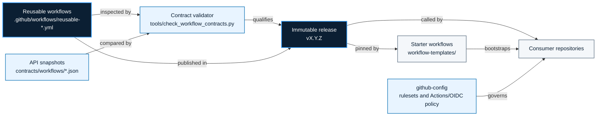

<!-- mindclade-doc: architecture@1 -->

# Mindclade · GitHub platform architecture

> **Audience:** Platform, security, and repository maintainers  
> **Outcome:** Understand where shared automation ends, where governance begins, and how a
> workflow change reaches consumers without bypassing review.

## Context

The `.github` repository is the versioned automation and contributor-experience layer for the
Mindclade GitHub Enterprise organization. It provides reusable workflow implementations,
required security-baseline workflow logic, starter workflows, community-health defaults, and
their machine-readable compatibility contracts.

It does not configure the organization or provision a cloud control plane. That separation
keeps workflow implementation review independent from the policies that require or authorize
those workflows.

## Authority boundary

### Owns

- reusable and required GitHub Actions workflow implementations;
- workflow API snapshots and release compatibility;
- starter workflow templates and smoke fixtures;
- community-health source content; and
- offline validation for workflow contracts, action pins, and repository invariants.

### Depends on

- `github-config` for repositories, rulesets, Actions policy, environments, variables, and OIDC
  claim configuration;
- `.github-private` for the member-only organization profile and internal navigation;
- `bootstrap` for the root GitHub-to-Google-Cloud federation anchor;
- `infrastructure-live` for normal workload identities and cloud resources; and
- consumer repositories for caller permissions and repository-specific CI composition.

### Explicitly excludes

- GitHub Enterprise desired state, Google Cloud resources, Kubernetes desired state, and
  application source.

## Component model

| Component | Responsibility | Source of truth |
| --- | --- | --- |
| Reusable workflows | Language CI, Terraform planning, OCI publication, WIF diagnostics, and repository hygiene | `.github/workflows/reusable-*.yml` |
| Required baseline | Dependency review and immutable third-party action enforcement | `.github/workflows/required-security-baseline.yml` |
| API contracts | Inputs, secrets, outputs, jobs, and explicit permissions | `contracts/workflows/*.json` |
| Consumer starters | Known-good calls pinned to an immutable release | `workflow-templates/` |
| Qualification | Offline validation plus hermetic workflow smoke tests | `tools/`, `testdata/`, `hygiene.yml`, `smoke.yml` |

## Change and release flow

1. A pull request changes a workflow and, when required, its contract snapshot and changelog.
2. Offline validators check repository invariants, action pins, and contract drift.
3. Smoke jobs call the reusable workflows against hermetic Go, Python, and Rust fixtures.
4. A reviewed full-semver tag starts `release.yml`; the workflow validates the tag and
   changelog before publishing the draft release.
5. Organization immutable-release controls lock the published release and tag.
6. Consumers adopt the new full-semver reference through independent reviewed changes.

Merging to `main` does not change a consumer. Moving a published tag is prohibited; corrections
use a new patch release.

## Trust and security boundaries

- Third-party actions are pinned to full commit SHAs.
- Consumer jobs grant the maximum `GITHUB_TOKEN` permissions a called workflow may use; a
  reusable workflow cannot elevate above its caller.
- Cloud access uses GitHub OIDC and Google Cloud WIF. No reusable workflow accepts a Google
  Cloud service-account JSON key.
- WIF authorization binds immutable organization/repository identity, expected workflow and
  ref, visibility, and repository policy claims.
- Jobs that plan/read and jobs that apply/publish use separate identities and permission
  surfaces.

The concrete claim contract is documented in [OIDC and WIF](WIF.md).

## Failure domains and recovery

| Failure | Blast radius | Recovery source |
| --- | --- | --- |
| Breaking workflow API | Consumers that adopt the release | Contract snapshot, changelog, and a corrective semver release |
| Bad but immutable release | Consumers pinned to that version | Publish a corrected patch; do not move the tag |
| WIF authorization failure | Cloud jobs for the affected identity | [OIDC and WIF qualification](WIF.md#qualification) |
| Required-baseline false positive | Protected merges in targeted repositories | Ruleset Evaluate mode, `github-config`, and a reviewed workflow patch |

## Invariants

- Reusable workflows are consumed only from immutable full-semver releases.
- Caller-visible contract changes are reviewed as API changes.
- Cloud credentials never escape the job in which authentication occurs.
- Workflow implementation and organization policy remain separate authorities.
- Fixtures qualify workflows before release; consumers still control adoption.

## Related documentation

- [Documentation home](README.md)
- [Workflow contracts](WORKFLOW_CONTRACTS.md)
- [Shared workflow release policy](release-policy.md)
- [GitHub Actions security](ACTIONS_SECURITY.md)
- [Enterprise setup](ENTERPRISE_SETUP.md)
