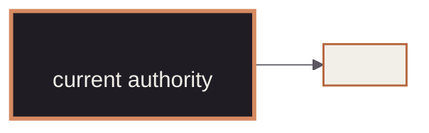

<!-- mindclade-doc-template: repository-home@2 -->

<!-- Brand distribution: mindclade/.github-private/mindclade-brand-assets (MONO family). -->

<p align="center">
  <picture>
    <source media="(prefers-color-scheme: dark)" srcset="docs/assets/brand/mono-wordmark-dark-1080w.png">
    <source media="(prefers-color-scheme: light)" srcset="docs/assets/brand/mono-wordmark-1080w.png">
    
  </picture>
</p>

<p align="center">
  " src="docs/assets/badges/repository-class.svg">
  " src="docs/assets/badges/visibility.svg">
  
  " src="docs/assets/badges/<stable-fact>.svg">
</p>

# Mindclade · <Repository name>

> **Platform Foundation · <Trust position>**
> <One sentence describing the repository's unique responsibility and reader outcome.>

| Repository contract | Value |
| --- | --- |
| Class | `<repository-class>` |
| Visibility | `<visibility>` |
| Change model | `pull-request` |
| Authority | `<authority-one>`<br>`<authority-two>` |
| Primary readers | <The people who use or maintain this repository> |
| First success | [<Outcome-oriented validation label>](#quick-start) |
| Start here | [`docs/README.md`](docs/README.md) |

## Mission

Explain why the repository exists, the outcome it owns, and the primary reader. Keep volatile
implementation and policy detail in an authoritative linked document.

## Authority boundary

### This repository creates

- <Authoritative responsibility from `contracts/repository.yaml`.>

### This repository deliberately does not create

- <Adjacent responsibility and the repository that owns it.>

## Quick start

State prerequisites and external-access requirements, then show the smallest credential-free
validation path to first success.

```sh
<enter the pinned toolchain>
<run the repository's validation command>
```

**Success means:** <Specific, observable success signal.>

**If it fails:** <First diagnostic and the authoritative troubleshooting or reference page.>

**Safety boundary:** <Planning, applying, deployment, promotion, or recovery action that must not
be run casually.>

## Estate position

Introduce one shared estate diagram and explain what its highlighted node means. The authority
table and boundary lists must preserve the same information for readers without Mermaid.



## Repository map

| Path | Purpose |
| --- | --- |
| `<path>` | <Authoritative responsibility of this path.> |

## Change path

Summarize review, validation, approval, apply/deploy, verification, and rollback at the level a
new contributor needs. Link to procedures instead of copying them into the repository home.

## Documentation and support

- [Documentation home](docs/README.md)
- [Architecture](docs/architecture.md)
- [Contributing](CONTRIBUTING.md)
- [Support](SUPPORT.md)
- Policies and terms: [governance](GOVERNANCE.md) ·
  [conduct](CODE_OF_CONDUCT.md) · [legal](LEGAL.md) ·
  [license](LICENSE) · [notice](NOTICE) · [changes](CHANGELOG.md)

## Security

Name repository-specific sensitive material and link to [the security policy](SECURITY.md).
Do not publish secret values, customer data, private model artifacts, restricted biological
data, or raw sensitive plan/state output.
